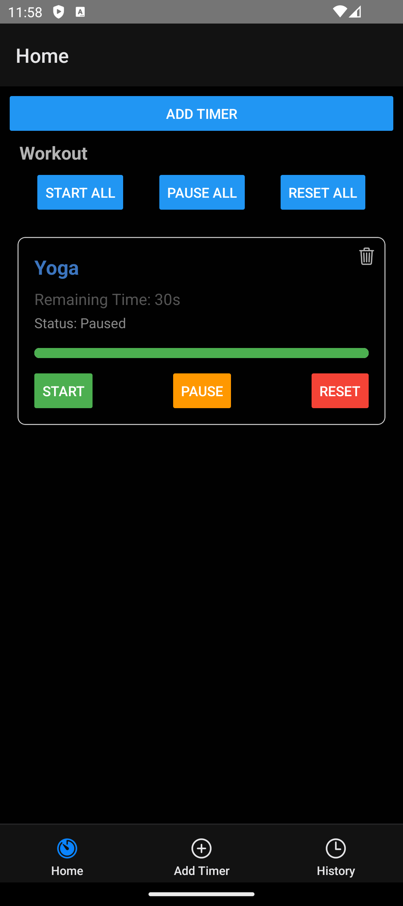
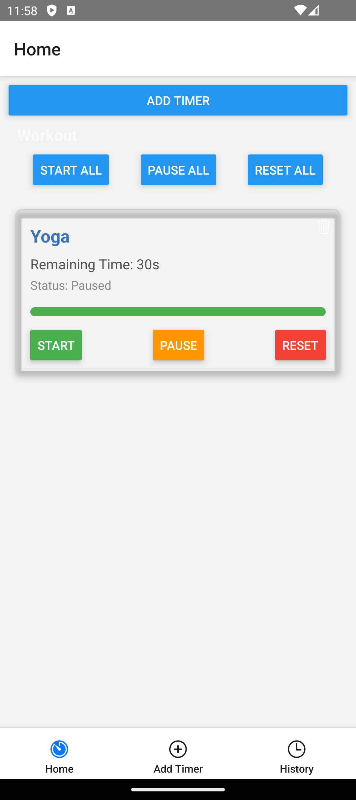

# Timer App

A React Native application to manage and interact with timers and history logs, featuring local persistence and theme toggling.

## **Screenshot**

<div style="display: flex; justify-content: space-around;">
  
  
</div>

---

## **Features**
- Create, manage, and track multiple timers.
- Persist timers and history logs in AsyncStorage.
- Dynamic light and dark theme support.
- Customizable timer settings.

---

## **Prerequisites**
Before running the app, ensure you have the following installed:
- **Node.js** (v18.x or later)
- **npm** or **yarn**
- **React Native CLI** (`npm install -g @react-native-community/cli`)
- **Android Studio** (for Android emulator)
- **Xcode** (for iOS development, macOS only)

---

## **Project Setup**
Follow these steps to set up and run the app:

### 1. **Clone the Repository**
```bash
git clone https://github.com/mujhusain/TimerApp.git
cd TimerApp
cd src

# Install node modules
npm install

# Open android simulator and run below command to start metro
npx react-native start-android